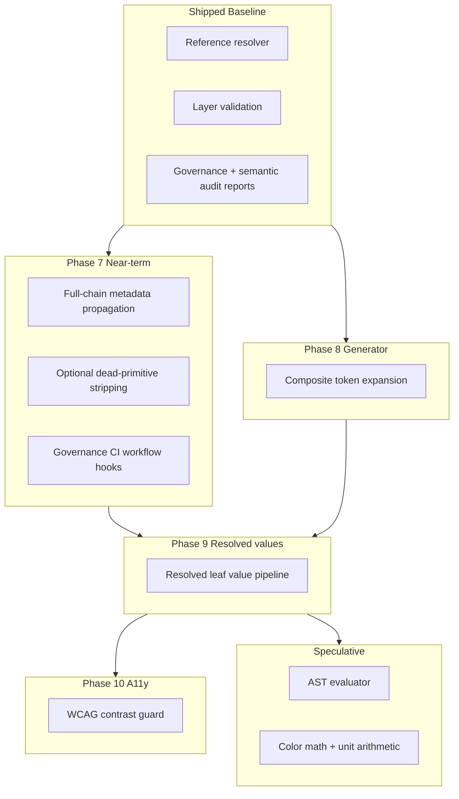

# Neurex Resolver Evolution

**Audience:** Maintainers
**Type:** Vision / implementation plan
**Status:** Phases 1–6 shipped; Phases 7–10 planned; speculative items deferred
**Source of truth for:** Resolver and governance evolution sequencing after the initial platform pass
**Verified against:** `packages/tokens/src/resolver/`, `packages/tokens/src/governance/`, `packages/tokens/src/generators/`

Current enforced rules and build-failing validation live in [docs/TOKENS.md](./TOKENS.md).
Platform phase history lives in [docs/ROADMAP.md](./ROADMAP.md).

---

## Overview

Neurex token validation and analysis split across three cooperating areas:

| Area | Location | Role |
| ---- | -------- | ---- |
| Reference resolver | `packages/tokens/src/resolver/resolver.ts` | Resolve `{dotted.path}` chains; output-agnostic |
| Layer validation | `packages/tokens/src/resolver/layer-validation.ts` | Build-failing layer contract enforcement |
| Governance + audit | `packages/tokens/src/governance/` | Non-blocking graph analysis and reports |
| Generator pipeline | `packages/tokens/src/generators/` | CSS/DTCG output; calls validation before generation |

Phases 1–6 (factory authoring, layer validation, governance reports, semantic organization) are complete.
Remaining work is sequenced below as Phases 7–10 plus explicitly deferred speculative capabilities.

---

## Shipped Baseline

These capabilities are implemented and enforced today. For build-failing vs
non-blocking behavior, see [docs/TOKENS.md — Validation Status](./TOKENS.md#validation-status).

### Reference resolver

**Entry point:** `packages/tokens/src/resolver/resolver.ts`

- Validates reference format (`{dotted.path}`)
- Detects missing references, branch references, circular chains, and max-depth violations (50 hops)
- Validates token leaf shape during resolution
- Operates in strict or safe mode
- Output-agnostic — no CSS, Tailwind, or DTCG knowledge

Invoked at build time via `validateStyleTokenInput` in
`packages/tokens/src/generators/inputs/input.source.ts`.

### Layer validation

**Entry point:** `packages/tokens/src/resolver/layer-validation.ts`

Build-failing layer contract checks:

- Component tokens must not reference primitive, brand, or theme-only tokens directly
- Semantic tokens must not reference component tokens
- Theme tokens must not reference component tokens
- Brand tokens must not use component-specific intent branches

Runs before reference resolution during `validateStyleTokenInput`.

### Governance and semantic audit (non-blocking)

**Entry points:**

- `packages/tokens/src/governance/create-governance-report.ts`
- `packages/tokens/src/governance/semantic-audit.ts`
- CLI: `pnpm --filter @neurex/tokens governance:report`

Available reports:

| Report | What it covers |
| ------ | -------------- |
| Metadata inventory | Tokens with `$description` or `$deprecated` |
| Deprecation dependents | Tokens marked `$deprecated` and their **direct** dependents |
| Dead primitives | Primitive leaf paths not reached by upper-layer reference chains |
| Semantic audit | Unused semantic paths, component-intent branches, theme path drift |

These reports analyze the token graph but do not change CSS or DTCG output.

---

## Phase Summary

| Phase | Name | Type | Depends on | Entry points |
| ----- | ---- | ---- | ---------- | ------------ |
| 7 | Governance hardening | Extends governance | Shipped baseline | `token-graph.utils.ts`, `create-governance-report.ts`, `generator.write.ts` |
| 8 | Composite expansion | Extends generators | Shipped baseline | `packages/tokens/src/generators/outputs/` |
| 9 | Resolved value pipeline | New resolver capability | Phases 7–8 (design) | `packages/tokens/src/resolver/` |
| 10 | Accessibility guard | Extends validation | Phase 9 | `packages/tokens/src/governance/` or new validator |
| — | Speculative (AST + math) | New subsystem | Phase 9 design | Not scheduled |

---

## Phase 7: Governance Hardening

**Status:** Planned — near-term
**Extends:** existing graph traversal in `packages/tokens/src/governance/`

### Goals

1. **Full-chain metadata propagation**
   - Reuse the `expandReferencedPaths` pattern already used for dead-token reachability in `create-governance-report.ts`
   - Surface **transitive** dependents for `$deprecated` and `$description`, not only direct reference matches
   - Output: extended deprecation/metadata sections in governance reports

2. **Optional dead-primitive stripping**
   - Opt-in generator flag in `generator.create.ts` / `generator.write.ts`
   - When enabled, omit unreached primitive leaves from CSS/DTCG output
   - Default: **off** — enabling is a breaking output change and requires explicit product decision

3. **Governance CI workflow**
   - Document recommended CI hook: `pnpm --filter @neurex/tokens governance:report`
   - Define decision gate for promoting governance warnings to build-failing checks (explicit maintainer choice, not automatic)

### Why first

No new subsystem. Builds on shipped graph traversal. Unblocks safer token cleanup without expression evaluation.

### Non-goals

- Changing layer validation rules
- Stripping semantics or components from output
- Auto-failing builds on dead primitives without an explicit policy decision

---

## Phase 8: Composite Token Expansion

**Status:** Planned
**Extends:** CSS and DTCG generators under `packages/tokens/src/generators/outputs/`

### Current behavior

Typography and other composite groups are consumed as **slot references** in component tokens (for example `{typography.control.md.fontSize}`). Composite leaves are not auto-flattened into atomic CSS variables in generated output.

### Target behavior

- Generator expands composite groups (typography first) into individual atomic variables
- Internal slot references continue resolving through the existing reference chain (for example `fontSize` → `{font.size.base}`)
- DTCG JSON output reflects expanded atomic leaves where appropriate

### Non-goals

- Changing component token authoring style — slot refs remain valid
- Expression evaluation or color math

### Why before contrast

Improves CSS/DTCG output fidelity without requiring a resolved-value pipeline.

---

## Phase 9: Resolved Value Pipeline

**Status:** Planned
**Type:** New resolver capability adjacent to `packages/tokens/src/resolver/resolver.ts`

### Target behavior

- Produce fully resolved scalar and object leaf values after reference chain resolution
- Support DTCG object values already authored in primitives (for example OKLCH color objects in `primitives/color.ts`)
- Remain output-agnostic — no CSS variable naming or Tailwind mapping in the resolver

### Prerequisites

- Phase 7 governance hardening (stable graph analysis patterns)
- Phase 8 composite expansion design (know which leaves are atomic vs composite)

### Unblocks

- Phase 10 contrast validation
- Future speculative color math (if ever adopted)

---

## Phase 10: Accessibility Guard

**Status:** Planned
**Depends on:** Phase 9 resolved value pipeline

### Target behavior

- Build-time WCAG AA contrast validation on declared semantic foreground/background pairs
- Start as a governance-style report (non-blocking)
- Promote to build-failing only after the pair inventory and threshold policy are agreed

### Non-goals

- Runtime accessibility checks in consumer apps
- Automatic pair discovery without an explicit semantic pair registry

---

## Speculative (Deferred)

**Status:** Not scheduled — no phase number, no near-term commitment

These capabilities require a formal expression evaluator. The current string-match reference resolver cannot evolve incrementally into them. **Do not implement until Phase 9 resolved-value design is settled.**

### AST evaluator subsystem

1. **Tokenizer** — breaks complex values like `({space.md} * 2) + 4px` into atomic tokens
2. **Parser** — builds a precedence-aware operation tree
3. **Evaluator** — resolves references and evaluates math and color expressions
4. **Serializer** — formats output for a specific generator target

### Color and unit math

- OKLCH-aware transformations (for example `oklch-modify({brand.color.primary}, l -10%)`)
- Unit-aware arithmetic across `rem`, `px`, `%` with configurable base font size

---

## Document Ownership

- **Current enforced rules:** [docs/TOKENS.md](./TOKENS.md)
- **Platform phase history:** [docs/ROADMAP.md](./ROADMAP.md)
- **Actionable backlog:** [docs/REVIEW_TODO.md](./REVIEW_TODO.md)
- **This document:** resolver/governance/generator evolution sequencing only

When a phase ships, update [docs/TOKENS.md](./TOKENS.md) for new build-failing or governance behavior, update [docs/ROADMAP.md](./ROADMAP.md) phase status, and record implementation detail in git history — not by expanding this document with completed checklists.
