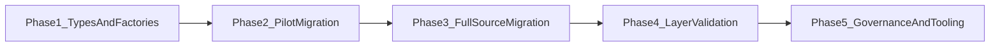

# Neurex Tokens Roadmap

**Audience:** Maintainers and token domain owners  
**Type:** Vision / strategy document  
**Status:** Planned work - not a current implementation contract  
**Source of truth for:** Long-term tokens platform direction and phased
evolution  
**Verified against:** `packages/tokens/src/` current state

**Related docs:**

- `docs/TOKENS.md` - canonical current token rules and layer/reference contract
- `docs/REVIEW_TODO.md` - active actionable backlog and known gaps
- `docs/RESOLVER_EVOLUTION.md` - resolver-specific planned evolution

---

## Current State

Current implementation:

- TypeScript token files are the source of truth for authoring.
- Token leaves use nested DTCG-shaped `$value` authoring.
- CSS and W3C/DTCG JSON are generated outputs.
- The resolver validates reference syntax, missing references, circular
  references, max-depth violations, and invalid DTCG token leaf shape when
  importing token JSON.
- Token groups currently support both legacy mixed-envelope source objects and
  the planned factory-produced metadata/token boundary during migration.

## Target State

Target architecture:

- New token source groups are authored through factory helpers.
- Token metadata and token payload are separated explicitly.
- Generator input reads `tokens` payloads directly for factory-authored groups.
- Legacy mixed-envelope source groups are migrated in phases.
- Layer-rule violations become build-failing validation before the token
  contract is considered stable.

## Phased Evolution

## Phase 1: Types And Factories

**Status:** completed

**Goal:** introduce explicit source group contracts and factory helpers without
changing generated CSS or DTCG output behavior.

**Deliverables:**

- Clear token branch/tree/node type aliases.
- Explicit token group metadata plus token payload contracts.
- Factory helpers for primitive, brand, semantic, component, and theme token
  groups.
- Backward-compatible generator input adapter for unmigrated source files.

**Non-goals:**

- Bulk migration of every token source file.
- Build-failing layer validation.
- Generated output renaming or behavior changes.

**Verification:**

- Token package lint, typecheck, tests, and full check pass.
- Type-surface tests cover factory output shape and generator input behavior.

## Phase 2: Pilot Migration

**Status:** completed

**Goal:** migrate a small representative set of token source files to establish
the authoring pattern.

**Deliverables:**

- `packages/tokens/src/components/button.ts` uses `componentTokens`.
- `packages/tokens/src/primitives/color.ts` uses `primitiveTokens`.
- `packages/tokens/src/themes/neurex/light.ts` uses `themeTokens`.

**Non-goals:**

- Migrating all components, primitives, semantics, brands, and themes.

**Verification:**

- `createStyleTokenInput()` keeps the same namespaced token tree behavior for
  migrated and unmigrated groups.
- Existing CSS and DTCG output tests continue to pass.

## Phase 3: Full Source Migration

**Status:** completed

**Goal:** migrate all remaining token source groups to factory authoring.

**Deliverables:**

- All primitive, brand, semantic, component, and theme source files use factory
  helpers.
- Legacy mixed-envelope support can be removed after migration is complete.

**Non-goals:**

- Changing token layer rules or generated output naming.

**Backlog link:** track actionable migration work in `docs/REVIEW_TODO.md` when
this phase becomes active.

**Verification:**

- Source search finds no legacy token group envelopes.
- Generator input no longer needs legacy adapter behavior.

## Phase 4: Layer Validation

**Status:** completed

**Goal:** make token layer contract violations build-failing.

**Deliverables:**

- Detect component-to-primitive, component-to-brand, component-to-theme,
  semantic-to-component, theme-to-component, and brand component-intent
  violations.
- Report violations with actionable paths.

**Non-goals:**

- Color math, contrast evaluation, or AST expression evaluation.

**Backlog link:** `docs/REVIEW_TODO.md` tracks the current known gap; resolver
planning details live in `docs/RESOLVER_EVOLUTION.md`.

**Verification:**

- Negative tests fail on known invalid layer references.
- Token package check fails for layer violations.

## Phase 5: Governance And Tooling

**Status:** completed

**Goal:** add higher-level token governance after the source contract and layer
validation are stable.

**Deliverables:**

- Deprecation and metadata reports.
- Dead token detection.
- Optional governance tooling around token ownership and change review.

**Non-goals:**

- Treating generated DTCG JSON as the TypeScript source replacement.

**Verification:**

- Reports are generated from the current token graph and do not change CSS or
  DTCG output unless explicitly configured.

## Document Ownership

- `docs/ROADMAP.md` owns long-term direction and phases.
- `docs/TOKENS.md` owns current token rules, layer definitions, and generated
  output contracts.
- `docs/REVIEW_TODO.md` owns actionable active work and known gaps.
- `docs/RESOLVER_EVOLUTION.md` owns resolver-specific target architecture.

## Maintenance Workflow

- Update `docs/ROADMAP.md` when direction, sequencing, or phase ownership
  changes.
- Update `docs/REVIEW_TODO.md` when a phase becomes actionable work.
- Update `docs/TOKENS.md` only when current token behavior or enforced rules
  change.
- Keep completed phases out of the roadmap body; git history records completed
  implementation details.
