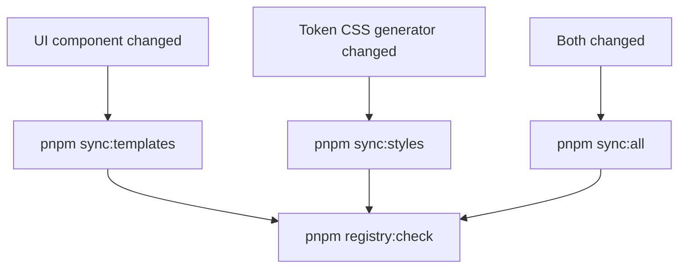

# Neurex Scripts Handbook

**Audience:** Maintainers, contributors, and agents
**Type:** Commands reference (monorepo `pnpm` scripts)
**Source of truth for:** Root and package script names, sync workflows, when to run checks
**Verified against:** Root and workspace `package.json` files, `turbo.json`

Run commands from the **repository root** unless noted. For consumer-facing CLI commands (`neurex init`, `neurex add`, …), see [CLI.md](./CLI.md).

---

## Quick reference (root)

| Script                          | Purpose                                                                               |
| ------------------------------- | ------------------------------------------------------------------------------------- |
| `pnpm check`                    | Full gate: Prettier + root ESLint + turbo `check` in all packages                     |
| `pnpm build`                    | Build all packages (turbo)                                                            |
| `pnpm dev`                      | Start dev servers (turbo)                                                             |
| `pnpm test`                     | Run all package tests (turbo)                                                         |
| `pnpm typecheck`                | Typecheck all packages (turbo)                                                        |
| `pnpm lint`                     | Root config ESLint + lint all packages (turbo)                                        |
| `pnpm lint:fix`                 | Auto-fix lint across root + packages                                                  |
| `pnpm format`                   | Format repo with Prettier                                                             |
| `pnpm format:check`             | Check Prettier formatting                                                             |
| `pnpm sync:templates`           | Sync UI components → registry templates                                               |
| `pnpm sync:styles`              | Regenerate token CSS in dist + registry style templates                               |
| `pnpm sync:all`                 | `sync:templates` then `sync:styles` — follow with `registry:check`                    |
| `pnpm tokens:check`             | Lint + typecheck + test `@neurex/tokens`                                              |
| `pnpm tokens:build`             | Build `@neurex/tokens`                                                                |
| `pnpm tokens:generate:styles`   | Write dist + registry style CSS                                                       |
| `pnpm tokens:governance:report` | Token governance + contrast audit report                                              |
| `pnpm tokens:imports:clean`     | Clean token import paths (maintenance)                                                |
| `pnpm ui:check`                 | Lint + typecheck + test `@neurex/ui`                                                  |
| `pnpm ui:build`                 | Build `@neurex/ui`                                                                    |
| `pnpm registry:check`           | Lint + typecheck + template/style sync checks + test                                  |
| `pnpm registry:sync`            | Sync UI source → registry component templates                                         |
| `pnpm registry:styles:sync`     | Alias for `tokens:generate:styles` via registry                                       |
| `pnpm cli:check`                | Turbo `check` for CLI (builds `@neurex/registry` first, then lint + typecheck + test) |
| `pnpm playground:dev`           | Start local playground (Vite)                                                         |
| `pnpm playground:check`         | Lint + typecheck playground                                                           |
| `pnpm playground:build`         | Build tokens + UI, then playground                                                    |

Per-package `*:lint:fix`, `*:typecheck`, and `*:build` aliases follow the same `{package}:{action}` pattern. See sections below.

---

## Repo-wide scripts

### `pnpm check`

Primary pre-merge gate:

```sh
pnpm format:check && pnpm lint:root && turbo run check
```

Turbo runs each workspace package's `check` script after building dependencies (`dependsOn: ["^build"]` in `turbo.json`).

### Partial runs

Use when you only need one layer:

| Command          | When                                   |
| ---------------- | -------------------------------------- |
| `pnpm test`      | Tests only                             |
| `pnpm typecheck` | Types only                             |
| `pnpm lint`      | Lint only (includes root config files) |
| `pnpm build`     | Build artifacts only                   |

---

## `@neurex/tokens`

| Root alias                      | Package script      | When to run                                                                            |
| ------------------------------- | ------------------- | -------------------------------------------------------------------------------------- |
| `pnpm tokens:build`             | `build`             | After token source changes; produces `dist/` + package CSS                             |
| `pnpm tokens:check`             | `check`             | After any token/resolver/generator edit                                                |
| `pnpm tokens:generate:styles`   | `generate:styles`   | After generator changes that affect CSS output; writes dist + registry style templates |
| `pnpm tokens:governance:report` | `governance:report` | Governance audit, contrast policy (CI on token PRs)                                    |
| `pnpm tokens:imports:clean`     | `imports:clean`     | Maintenance — normalize token import paths                                             |
| `pnpm tokens:lint:fix`          | `lint:fix`          | Auto-fix token package lint                                                            |
| `pnpm tokens:typecheck`         | `typecheck`         | Types only                                                                             |

Filter equivalent:

```sh
pnpm --filter @neurex/tokens <script>
```

---

## `@neurex/ui`

| Root alias          | Package script | When to run                                 |
| ------------------- | -------------- | ------------------------------------------- |
| `pnpm ui:build`     | `build`        | Build reference components                  |
| `pnpm ui:check`     | `check`        | After component, variant, or export changes |
| `pnpm ui:lint:fix`  | `lint:fix`     | Auto-fix UI package lint                    |
| `pnpm ui:typecheck` | `typecheck`    | Types only                                  |

Filter equivalent:

```sh
pnpm --filter @neurex/ui <script>
```

After UI component edits, also run `pnpm registry:sync` and `pnpm registry:check`. See [Sync workflows](#sync-workflows).

---

## `@neurex/registry`

| Root alias                  | Package script   | When to run                                                               |
| --------------------------- | ---------------- | ------------------------------------------------------------------------- |
| `pnpm registry:build`       | `build`          | Build registry metadata                                                   |
| `pnpm registry:check`       | `check`          | Before merge when UI, tokens, or registry items changed                   |
| `pnpm registry:sync`        | `templates:sync` | After UI component source edits                                           |
| `pnpm registry:styles:sync` | `styles:sync`    | After token CSS generator changes (delegates to `tokens:generate:styles`) |
| `pnpm registry:lint:fix`    | `lint:fix`       | Auto-fix registry package lint                                            |
| `pnpm registry:typecheck`   | `typecheck`      | Types only                                                                |

Package-only scripts (no root alias):

| Script                 | Purpose                                                                       |
| ---------------------- | ----------------------------------------------------------------------------- |
| `templates:check-sync` | Fail if component templates drift from UI (part of `registry:check`)          |
| `styles:check-sync`    | Fail if style templates drift from token generator (part of `registry:check`) |

Filter equivalent:

```sh
pnpm --filter @neurex/registry <script>
```

---

## `neurex` (CLI)

| Root alias           | Package script | When to run                            |
| -------------------- | -------------- | -------------------------------------- |
| `pnpm cli:build`     | `build`        | Build CLI binary                       |
| `pnpm cli:check`     | turbo `check`  | After CLI command or installer changes |
| `pnpm cli:lint:fix`  | `lint:fix`     | Auto-fix CLI package lint              |
| `pnpm cli:typecheck` | `typecheck`    | Types only                             |

`pnpm cli:check` runs `pnpm turbo run check --filter=./packages/cli`, so workspace
dependencies (notably `@neurex/registry`) are built before lint and typecheck.
Do not substitute `pnpm --filter ./packages/cli check` for the full gate — that
skips the turbo `^build` graph and ESLint can fail on unresolved registry types.

Filter equivalent for other CLI scripts (use path filter — root package is also named `neurex`):

```sh
pnpm --filter ./packages/cli <script>
```

For tests only (registry already built): `pnpm --filter ./packages/cli test`.

---

## `@neurex/playground`

| Root alias                  | Package script | When to run                                 |
| --------------------------- | -------------- | ------------------------------------------- |
| `pnpm playground:dev`       | `dev`          | Local visual verification                   |
| `pnpm playground:build`     | `build`        | Production build (builds tokens + UI first) |
| `pnpm playground:check`     | `check`        | Lint + typecheck playground                 |
| `pnpm playground:lint`      | `lint`         | Lint only                                   |
| `pnpm playground:lint:fix`  | `lint:fix`     | Auto-fix playground lint                    |
| `pnpm playground:typecheck` | `typecheck`    | Types only (builds tokens + UI first)       |

Playground has no Vitest tests today; `check` = lint + typecheck.

Filter equivalent:

```sh
pnpm --filter @neurex/playground <script>
```

---

## Sync workflows



| Scenario                                 | Commands                                              |
| ---------------------------------------- | ----------------------------------------------------- |
| Edited `packages/ui` components          | `pnpm registry:sync` → `pnpm registry:check`          |
| Edited token generator / CSS output      | `pnpm tokens:generate:styles` → `pnpm registry:check` |
| Edited both UI and token CSS             | `pnpm sync:all` → `pnpm registry:check`               |
| Edited registry items only (no UI drift) | `pnpm registry:check`                                 |

Component templates MUST NOT be edited manually under `packages/registry/templates/components/`. Style templates under `templates/styles/` are generated by `tokens:generate:styles`.

---

## Before merge

| Scenario                            | Minimum commands                        |
| ----------------------------------- | --------------------------------------- |
| Any PR                              | `pnpm check`                            |
| Token source / resolver / generator | `pnpm tokens:check`                     |
| UI components                       | `pnpm ui:check` + `pnpm registry:check` |
| Registry items or templates         | `pnpm registry:check`                   |
| CLI commands or installer           | `pnpm cli:check`                        |
| Playground-only changes             | `pnpm playground:check`                 |

Test coverage details and per-file test inventory: [TESTING.md](./TESTING.md).

---

## CI reference

### Monorepo check (all PRs)

[`.github/workflows/ci.yml`](../.github/workflows/ci.yml) runs on every pull request and on push to `dev`/`main`.

**Pull requests** — path-filtered jobs (via `dorny/paths-filter`):

| Filter                                     | Command                                          |
| ------------------------------------------ | ------------------------------------------------ |
| `packages/tokens/**`                       | `pnpm tokens:check`                              |
| `packages/ui/**`                           | `pnpm ui:check`                                  |
| `packages/ui/**` or `packages/registry/**` | `pnpm registry:check` (template drift on UI PRs) |
| `packages/cli/**`                          | `pnpm turbo run check --filter=./packages/cli`   |
| `apps/playground/**` (+ tokens/ui deps)    | `pnpm playground:build`                          |
| Root config/docs                           | `pnpm format:check` + `pnpm lint:root`           |

**Push to `dev`/`main`** — additionally runs full `pnpm check`.

**Audit** — non-blocking `pnpm audit --audit-level=high` on all workflow runs.

Setup: Node 24, `pnpm install --frozen-lockfile`, pnpm cache enabled.

### Token governance (token-path PRs)

[`.github/workflows/tokens-governance.yml`](../.github/workflows/tokens-governance.yml) runs when `packages/tokens/**` changes:

```sh
pnpm tokens:governance:report
# equivalent: pnpm --filter @neurex/tokens governance:report
```

With `NEUREX_CONTRAST_POLICY=ci` in CI.

### GitHub label sync (manifest changes)

[`.github/workflows/labels-sync.yml`](../.github/workflows/labels-sync.yml) keeps repo labels aligned with [`.github/labels.yml`](../.github/labels.yml) using [`github-label-sync`](https://github.com/Financial-Times/github-label-sync) v3 in **strict** mode (labels not in the manifest are deleted).

| Trigger | Behavior |
| --- | --- |
| Pull request touching `.github/labels.yml` | Dry-run only — diff in job log, no writes |
| Push to `dev` / `main` (manifest or workflow) | Apply sync to `DaLexto/neurex` |
| `workflow_dispatch` | Manual re-sync |

Local preview (requires a PAT with `repo` scope):

```sh
npx github-label-sync@3 --access-token <token> --labels .github/labels.yml --dry-run DaLexto/neurex
```

Taxonomy and usage: [CONTRIBUTING.md](../CONTRIBUTING.md) § GitHub labels.

---

## Turbo vs root alias vs filter

| Pattern                                      | Use when                                                         |
| -------------------------------------------- | ---------------------------------------------------------------- |
| `pnpm check`, `pnpm build`, `pnpm test`      | Run across all workspace packages via turbo                      |
| `pnpm tokens:check`, `pnpm registry:sync`, … | Daily maintainer shortcuts from repo root                        |
| `pnpm cli:check`                             | CLI gate via turbo (`^build` then lint + typecheck + test)       |
| `pnpm --filter @neurex/tokens test`          | Running a single package script without a root alias, or from CI |
| `pnpm --filter ./packages/cli test`          | CLI tests only (not the full check gate; registry must be built) |

Prefer root aliases in docs and commit messages when they exist. Use `--filter` when documenting the underlying package script or when no root alias exists (e.g. `templates:check-sync`).

---

## Related docs

| Document                                   | Owns                                                                       |
| ------------------------------------------ | -------------------------------------------------------------------------- |
| [TESTING.md](./TESTING.md)                 | Test file inventory, Vitest config, IDE extension, render-test conventions |
| [CLI.md](./CLI.md)                         | Consumer `neurex` CLI commands (not monorepo scripts)                      |
| [DEPLOY.md](./DEPLOY.md)                   | Release and publish contract                                               |
| [TROUBLESHOOTING.md](./TROUBLESHOOTING.md) | Common failure fixes (links here for command names)                        |
