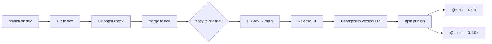
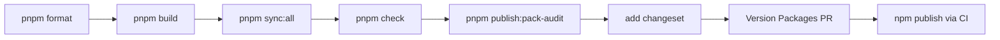

# Lexsys Deploy Guide

**Audience:** Maintainers
**Type:** Domain specification
**Source of truth for:** Build and publish contract, version lanes, pre-release gates, npm publish surface

**Related docs:** [Scripts reference](./SCRIPTS.md), [Testing docs](./TESTING.md), [Changelog](../../CHANGELOG.md)

---



---

## Publish surface

Lexsys is **registry-first**: consumers install via the `lexsys` entry package
(`lexsys` binary); they do not import `@dalexto/lexsys-ui` as a runtime library.

| Package             | npm name                   | Publish? | Role                                                           |
| ------------------- | -------------------------- | -------- | -------------------------------------------------------------- |
| `packages/entry`    | `@dalexto/lexsys`          | **Yes**  | Thin entry shim — `npx @dalexto/lexsys@next`; delegates to CLI |
| `packages/cli`      | `@dalexto/lexsys-cli`      | **Yes**  | CLI binary (`lexsys`); all command logic                       |
| `packages/registry` | `@dalexto/lexsys-registry` | **Yes**  | Runtime dep of CLI; templates + metadata                       |
| `packages/ui`       | `@dalexto/lexsys-ui`       | **No**   | Monorepo reference; copies ship via registry                   |
| `packages/tokens`   | `@dalexto/lexsys-tokens`   | **No**   | Token CSS ships in registry style templates                    |
| Root workspace      | `lexsys-monorepo`          | **No**   | Monorepo orchestrator only                                     |

All three published packages are version-locked via Changesets `fixed` group —
they always publish together at the same version.

Token CSS reaches consumers through registry style templates
(`templates/styles/tokens.css`, `theme.css`), not through a separate npm install.

Do not publish `@dalexto/lexsys-ui` or `@dalexto/lexsys-tokens` until there is an
explicit product decision and this file is updated.

---

## Version lane

| Milestone     | Version | npm dist-tag | Meaning                                      |
| ------------- | ------- | ------------ | -------------------------------------------- |
| First publish | `0.0.1` | `next`       | Initial release 2026-05-24 — historical      |
| Current       | `0.0.2` | `next`       | Early preview; breaking changes still likely |
| Iterations    | `0.0.x` | `next`       | Changesets patch/minor on the 0.0 line       |
| MVP stable    | `0.1.0` | `latest`     | Public MVP commitment — future milestone     |

Install for early preview:

```bash
npx @dalexto/lexsys@next init vite my-app
```

---

## Versioning policy

### Stability contract

- **`0.0.x` @ `next`** — no stability guarantee. Breaking changes MAY ship
  without a major version bump. Consumers on `@next` accept this risk.
- **`0.1.0+` @ `latest`** — MVP stable. Semver MUST be respected from this
  point: breaking changes require a major bump.

### What counts as a breaking change

Lexsys is a CLI installer, not a library — the breaking change definition is
non-obvious:

| Change | Breaking |
| ------ | -------- |
| CLI command or flag rename / removal | Yes |
| Config format change (`lexsys.config.ts`) | Yes |
| Registry item ID rename | Yes |
| Template content update | **No** — consumer owns installed code |
| New CLI commands or flags | No |
| New registry items | No |
| Token CSS variable rename (`--lex-*`) | Yes — breaks existing consumer CSS |

### Release notes

Every release MUST call out in CHANGELOG:

- new installable components
- CLI behavior changes
- config format changes
- breaking template or token changes
- any manual consumer migration required

If there is no consumer-facing impact, state that explicitly.

---

## Pre-release gate

Run before any publish attempt. All steps MUST pass.



```bash
pnpm format
pnpm build
pnpm sync:all
pnpm check
pnpm publish:pack-audit
```

(`pnpm check` includes `format:check` — run `pnpm format` first so Prettier
violations do not fail the gate.)

**Pre-publish checklist:**

- [ ] `pnpm publish:pack-audit` passes locally
- [ ] package `exports` are explicit in each `package.json`
- [ ] `files` field includes only intended distributable assets
- [ ] no package deep-imports another package's `src/` structure
- [ ] CLI does not assume repository-only file paths in published usage
- [ ] `pnpm sync:all && pnpm registry:check` passes — registry in sync with UI
- [ ] CHANGELOG entry drafted for this release

---

## Release workflow

### 0.0.x bump (`@next`)

For any patch or minor release on the `0.0.x` line:

1. Run pre-release gate (see above)
2. Add a changeset: `pnpm changeset`
3. Merge the Changesets "Version Packages" PR to `main`
4. Release CI publishes automatically on merge to `main`
5. Verify: `npm view @dalexto/lexsys dist-tags` shows updated `next` version
6. Post-publish smoke in a clean temp directory:

```bash
npx --yes @dalexto/lexsys@next init vite smoke-test
cd smoke-test
npx --yes @dalexto/lexsys@next add button
npm run build
```

(`npx @dalexto/lexsys@next` scaffolds with **npm** — use `npm run build`, not
`pnpm build`. Monorepo sandboxes linked via pnpm keep `pnpm build`.)

### 0.1.0 stable (`@latest`)

Additional steps beyond the standard 0.0.x flow:

1. Run pre-release gate: `pnpm format && pnpm build && pnpm sync:all && pnpm check && pnpm publish:pack-audit`
2. Consumer sandbox QA — `$consumer-sandbox-verify` checklist including narrow
   viewport (`< md`) pass ([Testing docs § Consumer sandbox](./TESTING.md#consumer-sandbox-verification))
3. Add changeset with minor bump → `0.1.0`
4. Update Changesets config and publish CI to use dist-tag **`latest`**
5. Merge Version Packages PR to `main` → Release CI publishes
6. README: update install command to remove `@next`
7. Update CHANGELOG `[0.1.0]` entry and dist-tag policy in this file
8. Add `npm publish --provenance` to the Release CI workflow (see [Supply chain security](#supply-chain-security))

**First-time `@latest` smoke:**

```bash
npx --yes @dalexto/lexsys init vite smoke-stable
cd smoke-stable
npx --yes @dalexto/lexsys add button
npm run build
```

---

## Rollback and hotfix

### Bad publish procedure

1. **Deprecate the bad version** — preferred over unpublish:
   ```bash
   npm deprecate @dalexto/lexsys-cli@0.0.x "known issue — use 0.0.y"
   npm deprecate @dalexto/lexsys-registry@0.0.x "known issue — use 0.0.y"
   npm deprecate @dalexto/lexsys@0.0.x "known issue — use 0.0.y"
   ```
   Consumers see a deprecation warning on install but the package remains available.

2. **Roll back the dist-tag** to a known-good version:
   ```bash
   npm dist-tag add @dalexto/lexsys@0.0.y next
   npm dist-tag add @dalexto/lexsys-cli@0.0.y next
   npm dist-tag add @dalexto/lexsys-registry@0.0.y next
   ```

3. **Hotfix flow:** fix on a branch → `0.0.z` patch bump → pass pre-release gate → publish → deprecate the bad version.

### npm unpublish limitations

`npm unpublish` is only available within **72 hours** of publish AND only when
the package has no dependents. After the window closes, use `npm deprecate`
instead. Never rely on unpublish as a rollback strategy for production releases.

### Registry-first caveat

A CLI rollback does **not** recall already-installed consumer code. Consumers
who ran `lexsys add <component>` with a buggy release retain that code in their
repository — it is user-owned. Rollback only prevents new installs from pulling
the bad version. Communicate the issue directly when affected consumers need to
manually update their installed files.

---

## Package build contract

Each publish-oriented package MUST build from `src/` into `dist/`.

| Requirement | Rule |
| ----------- | ---- |
| Source | `src/` is source only — never import from another package's `src/` |
| Output | `dist/` is the distributable output |
| Exports | `package.json` `exports` MUST point to `dist` paths only |
| Files | Publishable files MUST be explicitly declared in `package.json` `files` |

### Per-package dist requirements

**`packages/entry` (`@dalexto/lexsys`)**
- Compiled shim in `dist/`; working `bin` delegation to `@dalexto/lexsys-cli`

**`packages/cli` (`@dalexto/lexsys-cli`)**
- Compiled executable entry in `dist/`
- Working `bin` mapping
- Runtime access only to publishable package assets — no repository-only paths

**`packages/registry` (`@dalexto/lexsys-registry`)**
- Compiled metadata entrypoints in `dist/`
- Templates included in `package.json` `files`
- No deep-import dependency on repository-only paths at runtime

**`packages/ui` and `packages/tokens`** — not published; see [Publish surface](#publish-surface).

---

## Registry sync rule

Because Lexsys is registry-first, release quality is not only about compiled
code. Registry templates are generated from `packages/ui` source — they MUST
remain in sync.

A valid release MUST keep these in sync:

- registry metadata (`packages/registry/src/items/`)
- registry templates (`packages/registry/templates/`)
- CLI install behavior
- shared utilities

If any of these drift, the release is incomplete even if TypeScript builds pass.
Run `pnpm sync:all && pnpm registry:check` before every publish.

---

## CI policy

CI runs on pull requests and pushes to `dev`/`main` via
[`.github/workflows/ci.yml`](../../.github/workflows/ci.yml) (Node 24, frozen
lockfile). Pull requests use path-filtered jobs; pushes to `dev`/`main` run a
full `pnpm check`. Token-path PRs also run
[tokens-governance](../../.github/workflows/tokens-governance.yml).

**Lockfile and dependency rules:**

- CI MUST use `pnpm install --frozen-lockfile` — do not commit hand-edited
  `pnpm-lock.yaml` without running install locally.
- Node version MUST match root `engines` field and CI (Node 24).
- Dependabot opens weekly update PRs via
  [`.github/dependabot.yml`](../../.github/dependabot.yml); review grouped
  bumps before merge.
- `pnpm audit --audit-level=high` runs as a non-blocking CI job; fix high
  severity issues before release when practical.

Turbo remote cache is optional — local cache is sufficient at current repo size.
Maintainers MAY enable Vercel Remote Cache via `TURBO_TOKEN` / `TURBO_TEAM` in
GitHub Actions secrets if CI duration grows.

---

## Supply chain security

| Control | Status |
| ------- | ------ |
| `--frozen-lockfile` in CI | implemented |
| Granular NPM_TOKEN (scoped publish permissions per package) | implemented |
| `npm publish --provenance` (links package to GitHub Actions workflow) | planned — add at `0.1.0` |
| OIDC trusted publishing (replaces NPM_TOKEN with GitHub OIDC) | deferred |
| Signed releases (sigstore) | deferred |

**Notes:**

- The Granular NPM_TOKEN scopes publish access to specific packages — this is
  the primary publish authorization control, not a bypass of security.
- `npm publish --provenance` requires no additional tokens — it uses the GitHub
  Actions OIDC token automatically when run in CI. Add `--provenance` to the
  release workflow at `0.1.0`.
- Deferred items tracked in [Backlog § Known Gaps](../REVIEW_TODO.md#known-gaps).

---

## Deferred

Known gaps and deferred security/tooling work:
[Backlog § Known Gaps](../REVIEW_TODO.md#known-gaps).

Historical release records (0.0.1 first publish, M4/M10 implementation tracks):
[Changelog](../../CHANGELOG.md) and git history.
