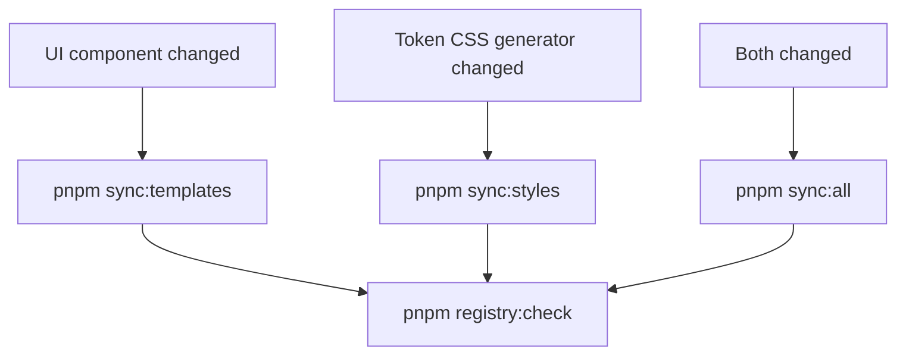

# Lexsys Scripts Handbook

**Audience:** Maintainers, contributors, and agents
**Type:** Commands reference (monorepo `pnpm` scripts)
**Source of truth for:** Root and package script names, sync workflows, when to run checks
**Verified against:** Root and workspace `package.json` files, `turbo.json`
**Last reviewed:** 2026-05-30 (script contract + root alias matrix)

---

## On this page

- [Quick reference (root)](#quick-reference-root)
- [Repo-wide scripts](#repo-wide-scripts)
  - [pnpm check](#pnpm-check)
  - [Partial runs](#partial-runs)
- [@dalexto/lexsys-tokens](#dalextolexsys-tokens)
- [@dalexto/lexsys-ui](#dalextolexsys-ui)
- [@dalexto/lexsys-registry](#dalextolexsys-registry)
- [lexsys (CLI)](#lexsys-cli)
- [@dalexto/lexsys-playground](#dalextolexsys-playground)
- [Sync workflows](#sync-workflows)
- [Before merge](#before-merge)
- [CI reference](#ci-reference)
  - [Monorepo check (all PRs)](#monorepo-check-all-prs)
  - [Token governance (token-path PRs)](#token-governance-token-path-prs)
  - [GitHub label sync (manifest changes)](#github-label-sync-manifest-changes)
- [Turbo vs root alias vs filter](#turbo-vs-root-alias-vs-filter)
- [Publish (M10)](#publish-m10)
  - [pnpm publish:pack-audit](#pnpm-publishpack-audit)
  - [pnpm changeset](#pnpm-changeset)
  - [pnpm version-packages](#pnpm-version-packages)
  - [pnpm publish:release](#pnpm-publishrelease)

Run commands from the **repository root** unless noted. For consumer-facing CLI commands (`lexsys init`, `lexsys add`, …), see [CLI reference](../reference/cli/CLI.md).

---

## Quick reference (root)

| Script                          | Purpose                                                                                                 |
| ------------------------------- | ------------------------------------------------------------------------------------------------------- |
| `pnpm check`                    | Full gate: Prettier + root ESLint + turbo `check` in all packages                                       |
| `pnpm build`                    | Build all packages (turbo)                                                                              |
| `pnpm dev`                      | Start dev servers (turbo)                                                                               |
| `pnpm test`                     | Run all package tests (turbo)                                                                           |
| `pnpm typecheck`                | Typecheck all packages (turbo)                                                                          |
| `pnpm lint`                     | Root config ESLint + lint all packages (turbo)                                                          |
| `pnpm lint:fix`                 | Auto-fix lint across root + packages                                                                    |
| `pnpm format`                   | Format repo with Prettier                                                                               |
| `pnpm format:check`             | Check Prettier formatting                                                                               |
| `pnpm sync:templates`           | Sync UI components → registry templates                                                                 |
| `pnpm sync:styles`              | Regenerate token CSS in dist + registry style templates                                                 |
| `pnpm sync:all`                 | `sync:templates` then `sync:styles` — follow with `registry:check`                                      |
| `pnpm tokens:check`             | Lint + typecheck + test `@dalexto/lexsys-tokens`                                                        |
| `pnpm tokens:build`             | Build `@dalexto/lexsys-tokens`                                                                          |
| `pnpm tokens:generate:styles`   | Write dist + registry style CSS                                                                         |
| `pnpm tokens:governance:report` | Token governance + contrast audit report                                                                |
| `pnpm tokens:imports:clean`     | Clean token import paths (maintenance)                                                                  |
| `pnpm tokens:re-prefix`         | Rename CSS var + BEM class prefix codebase-wide; regenerates styles + syncs registry (rebrand utility)  |
| `pnpm ui:check`                 | Lint + typecheck + test `@dalexto/lexsys-ui`                                                            |
| `pnpm ui:audit`                 | Variant literal scan **and** `UI_CATALOG.md` drift check                                                |
| `pnpm ui:audit:catalog:check`   | Fail if catalog region drifted from UI exports / registry item names                                    |
| `pnpm ui:audit:catalog:write`   | Regenerate catalog tables in [UI catalog](../reference/ui/UI_CATALOG.md)                                |
| `pnpm ui:build`                 | Build `@dalexto/lexsys-ui`                                                                              |
| `pnpm registry:check`           | Lint + typecheck + template/style sync checks + test                                                    |
| `pnpm registry:sync`            | Sync UI source → registry component templates                                                           |
| `pnpm registry:styles:sync`     | Alias for `tokens:generate:styles` via registry                                                         |
| `pnpm cli:check`                | Turbo `check` for CLI (builds `@dalexto/lexsys-registry` first, then lint + typecheck + test)           |
| `pnpm publish:pack-audit`       | M10 publish gate: metadata audit + `pnpm pack` for `@dalexto/lexsys-cli` and `@dalexto/lexsys-registry` |
| `pnpm changeset`                | Add a changeset for publish-package changes                                                             |
| `pnpm playground:dev`           | Start local playground (Vite)                                                                           |
| `pnpm playground:check`         | Lint + typecheck playground                                                                             |
| `pnpm playground:build`         | Build tokens + UI, then playground                                                                      |
| `pnpm scripts:check`            | Validate root `{scope}:{script}` aliases match workspace packages                                       |

Per-package shortcuts use `{scope}:{action}` (for example `pnpm ui:test`, `pnpm tokens:lint`). See sections below.

### Two-layer model

| Layer                    | Examples                                | Implementation                                                              |
| ------------------------ | --------------------------------------- | --------------------------------------------------------------------------- |
| **Repo-wide**            | `pnpm check`, `pnpm test`, `pnpm build` | `turbo run` across all workspace packages                                   |
| **Scoped (one package)** | `pnpm ui:test`, `pnpm registry:check`   | Root alias → `turbo run <task> --filter=@dalexto/lexsys-*` for Tier-0 tasks |
| **Tier-1 ops**           | `pnpm registry:sync`, `pnpm ui:audit`   | Root alias → `pnpm --filter … run …` (not in `turbo.json`)                  |
| **Format**               | `pnpm format`, `pnpm format:check`      | Root only — not per-package                                                 |

**Format** stays repo-level (single Prettier config). Do not add `format` scripts to workspace packages.

---

## Repo-wide scripts

### `pnpm check`

Primary pre-merge gate:

```sh
pnpm format:check && pnpm lint:root && turbo run check
```

Turbo runs each workspace package's `check` script after building dependencies (`dependsOn: ["^build"]` in `turbo.json`).

### Partial runs

Use when you only need one layer:

| Command          | When                                   |
| ---------------- | -------------------------------------- |
| `pnpm test`      | Tests only                             |
| `pnpm typecheck` | Types only                             |
| `pnpm lint`      | Lint only (includes root config files) |
| `pnpm build`     | Build artifacts only                   |

---

## `@dalexto/lexsys-tokens`

| Root alias                      | Package script      | When to run                                                                                                                                                                                                |
| ------------------------------- | ------------------- | ---------------------------------------------------------------------------------------------------------------------------------------------------------------------------------------------------------- |
| `pnpm tokens:build`             | `build`             | After token source changes; produces `dist/` + package CSS                                                                                                                                                 |
| `pnpm tokens:check`             | `check`             | After any token/resolver/generator edit                                                                                                                                                                    |
| `pnpm tokens:generate:styles`   | `generate:styles`   | After generator changes that affect CSS output; writes dist + registry style templates                                                                                                                     |
| `pnpm tokens:governance:report` | `governance:report` | Governance audit, contrast policy (CI on token PRs)                                                                                                                                                        |
| `pnpm tokens:imports:clean`     | `imports:clean`     | Maintenance — normalize token import paths                                                                                                                                                                 |
| `pnpm tokens:re-prefix`         | `re-prefix`         | Rename CSS var + BEM class prefix across source, docs, test configs; post-rename: regenerates styles + syncs registry. See [`scripts/rebrand/rename-prefix.mjs`](../../scripts/rebrand/rename-prefix.mjs). |
| `pnpm tokens:lint`              | `lint`              | Lint only (turbo)                                                                                                                                                                                          |
| `pnpm tokens:lint:fix`          | `lint:fix`          | Auto-fix token package lint                                                                                                                                                                                |
| `pnpm tokens:test`              | `test`              | Vitest only (turbo; faster than `tokens:check`)                                                                                                                                                            |
| `pnpm tokens:typecheck`         | `typecheck`         | Types only                                                                                                                                                                                                 |

Tier-0 aliases use `turbo run` with `^build`. Advanced: `turbo run test --filter=@dalexto/lexsys-tokens`.

---

## `@dalexto/lexsys-ui`

| Root alias                    | Package script        | When to run                                                          |
| ----------------------------- | --------------------- | -------------------------------------------------------------------- |
| `pnpm ui:build`               | `build`               | Build reference components                                           |
| `pnpm ui:check`               | `check`               | After component, variant, or export changes (includes `audit`)       |
| `pnpm ui:audit`               | `audit`               | Variant literals + catalog drift (blocking subset of `ui:check`)     |
| `pnpm ui:audit:catalog:check` | `audit:catalog:check` | Catalog-only drift check                                             |
| `pnpm ui:audit:catalog:write` | `audit:catalog:write` | Refresh [UI catalog](../reference/ui/UI_CATALOG.md) generated region |
| `pnpm ui:lint`                | `lint`                | Lint only (turbo)                                                    |
| `pnpm ui:lint:fix`            | `lint:fix`            | Auto-fix UI package lint                                             |
| `pnpm ui:test`                | `test`                | Vitest only (turbo; faster than `ui:check`)                          |
| `pnpm ui:typecheck`           | `typecheck`           | Types only                                                           |

Tier-1 (`audit*`) uses `pnpm --filter … run …` — not registered in `turbo.json`.

After UI component edits, also run `pnpm registry:sync` and `pnpm registry:check`. When named exports or registry item versions change, run `pnpm ui:audit:catalog:write` then commit [UI catalog](../reference/ui/UI_CATALOG.md). See [Sync workflows](#sync-workflows).

---

## `@dalexto/lexsys-registry`

| Root alias                           | Package script         | When to run                                                               |
| ------------------------------------ | ---------------------- | ------------------------------------------------------------------------- |
| `pnpm registry:build`                | `build`                | Build registry metadata                                                   |
| `pnpm registry:check`                | `check`                | Before merge when UI, tokens, or registry items changed                   |
| `pnpm registry:sync`                 | `templates:sync`       | After UI component source edits                                           |
| `pnpm registry:styles:sync`          | `styles:sync`          | After token CSS generator changes (delegates to `tokens:generate:styles`) |
| `pnpm registry:lint`                 | `lint`                 | Lint only (turbo)                                                         |
| `pnpm registry:lint:fix`             | `lint:fix`             | Auto-fix registry package lint                                            |
| `pnpm registry:templates:check-sync` | `templates:check-sync` | Template drift only (also part of `registry:check`)                       |
| `pnpm registry:styles:check-sync`    | `styles:check-sync`    | Style template drift only (also part of `registry:check`)                 |
| `pnpm registry:test`                 | `test`                 | Vitest only (turbo)                                                       |
| `pnpm registry:typecheck`            | `typecheck`            | Types only                                                                |

---

## `lexsys` (CLI)

| Root alias           | Package script | When to run                            |
| -------------------- | -------------- | -------------------------------------- |
| `pnpm cli:build`     | `build`        | Build CLI binary                       |
| `pnpm cli:check`     | `check`        | After CLI command or installer changes |
| `pnpm cli:lint`      | `lint`         | Lint only (turbo)                      |
| `pnpm cli:lint:fix`  | `lint:fix`     | Auto-fix CLI package lint              |
| `pnpm cli:test`      | `test`         | Vitest only (turbo; builds `^deps`)    |
| `pnpm cli:typecheck` | `typecheck`    | Types only                             |

All `cli:*` Tier-0 aliases use `turbo run check --filter=@dalexto/lexsys-cli` (or the matching task), so `@dalexto/lexsys-registry` is built via `^build` before lint/typecheck/test. Do not substitute bare `pnpm --filter @dalexto/lexsys-cli check` — that skips the turbo dependency graph.

---

## `@dalexto/lexsys-playground`

| Root alias                  | Package script | When to run                                                    |
| --------------------------- | -------------- | -------------------------------------------------------------- |
| `pnpm playground:dev`       | `dev`          | Optional monorepo smoke (maintenance-only; not consumer truth) |
| `pnpm playground:build`     | `build`        | Production build (builds tokens + UI first)                    |
| `pnpm playground:check`     | `check`        | Lint + typecheck playground                                    |
| `pnpm playground:lint`      | `lint`         | Lint only                                                      |
| `pnpm playground:lint:fix`  | `lint:fix`     | Auto-fix playground lint                                       |
| `pnpm playground:typecheck` | `typecheck`    | Types only (builds tokens + UI first)                          |
| `pnpm playground:preview`   | `preview`      | Vite preview of production build                               |

Playground has no Vitest tests today; `check` = lint + typecheck. No `playground:test` alias (intentional).

---

## Sync workflows



| Scenario                                     | Commands                                                                                                                                       |
| -------------------------------------------- | ---------------------------------------------------------------------------------------------------------------------------------------------- |
| Edited `packages/ui` components              | `pnpm registry:sync` → `pnpm registry:check`                                                                                                   |
| Edited token generator / CSS output          | `pnpm tokens:generate:styles` → `pnpm registry:check`                                                                                          |
| Edited both UI and token CSS                 | `pnpm sync:all` → `pnpm registry:check`                                                                                                        |
| Hand-edited `src/items/` only (no UI change) | `pnpm registry:check` — note: next `pnpm registry:sync` reconciles items from UI and overwrites most fields (preserves `aliases` / `category`) |

Component templates MUST NOT be edited manually under `packages/registry/templates/{primitives,blocks,templates}/`. Style templates under `templates/styles/` are generated by `tokens:generate:styles`.

---

## Before merge

| Scenario                            | Minimum commands                                                                                      |
| ----------------------------------- | ----------------------------------------------------------------------------------------------------- |
| Any PR                              | `pnpm check`                                                                                          |
| Token source / resolver / generator | `pnpm tokens:check`                                                                                   |
| UI components                       | `pnpm ui:check` + `pnpm registry:check` (+ `pnpm ui:audit:catalog:write` if exports/versions changed) |
| Registry items or templates         | `pnpm registry:check`                                                                                 |
| CLI commands or installer           | `pnpm cli:check`                                                                                      |
| Playground-only changes             | `pnpm playground:check`                                                                               |

Test coverage details and per-file test inventory: [Testing docs](../operations/TESTING.md).

---

## CI reference

### Monorepo check (all PRs)

[`.github/workflows/ci.yml`](../.github/workflows/ci.yml) runs on every pull request and on push to `dev`/`main`.

**Pull requests** — path-filtered jobs (via `dorny/paths-filter`):

| Filter                                     | Command                                          |
| ------------------------------------------ | ------------------------------------------------ |
| `packages/tokens/**`                       | `pnpm tokens:check`                              |
| `packages/ui/**`                           | `pnpm ui:check`                                  |
| `packages/ui/**` or `packages/registry/**` | `pnpm registry:check` (template drift on UI PRs) |
| `packages/cli/**`                          | `pnpm turbo run check --filter=./packages/cli`   |
| `apps/playground/**` (+ tokens/ui deps)    | `pnpm playground:build`                          |
| Root config/docs                           | `pnpm format:check` + `pnpm lint:root`           |

**Push to `dev`/`main`** — additionally runs full `pnpm check`.

**Audit** — non-blocking `pnpm audit --audit-level=high` on all workflow runs.

Setup: Node 24, `pnpm install --frozen-lockfile`, pnpm cache enabled.

### Token governance (token-path PRs)

[`.github/workflows/tokens-governance.yml`](../.github/workflows/tokens-governance.yml) runs when `packages/tokens/**` changes:

```sh
pnpm tokens:governance:report
# equivalent: pnpm --filter @dalexto/lexsys-tokens governance:report
```

With `LEXSYS_CONTRAST_POLICY=ci` in CI.

### GitHub label sync (manifest changes)

[`.github/workflows/labels-sync.yml`](../.github/workflows/labels-sync.yml) keeps repo labels aligned with [`.github/labels.yml`](../.github/labels.yml) using [`github-label-sync`](https://github.com/Financial-Times/github-label-sync) v3 in **strict** mode (labels not in the manifest are deleted).

| Trigger                                       | Behavior                                  |
| --------------------------------------------- | ----------------------------------------- |
| Pull request touching `.github/labels.yml`    | Dry-run only — diff in job log, no writes |
| Push to `dev` / `main` (manifest or workflow) | Apply sync to `DaLexto/lexsys-ui`         |
| `workflow_dispatch`                           | Manual re-sync                            |

Local preview (requires a PAT with `repo` scope):

```sh
npx github-label-sync@3 --access-token <token> --labels .github/labels.yml --dry-run DaLexto/lexsys-ui
```

Taxonomy and usage: [Contributing](../contributors/CONTRIBUTING.md) § GitHub labels.

### PR status label cleanup (merged PRs)

[`.github/workflows/pr-status-label-cleanup.yml`](../.github/workflows/pr-status-label-cleanup.yml) runs on `pull_request` `closed` when `merged == true` and removes `status:ready-for-review` via `gh pr edit --remove-label`. No checkout required; uses `GITHUB_TOKEN` with `issues: write`.

| Trigger              | Behavior                                              |
| -------------------- | ----------------------------------------------------- |
| PR merged            | Remove `status:ready-for-review` if present           |
| PR closed unmerged   | No-op (job skipped)                                   |
| Label already absent | Step succeeds with `continue-on-error` (harmless log) |

Does not retroactively clean PRs merged before the workflow existed.

---

## Turbo vs root alias vs filter

| Pattern                                      | Use when                                                 |
| -------------------------------------------- | -------------------------------------------------------- |
| `pnpm check`, `pnpm build`, `pnpm test`      | All workspace packages (turbo)                           |
| `pnpm ui:test`, `pnpm tokens:check`, …       | **Default** — one package from repo root                 |
| `pnpm registry:sync`, `pnpm ui:audit`        | Tier-1 ops (`pnpm --filter … run …`)                     |
| `pnpm scripts:check`                         | After editing root or workspace `package.json` scripts   |
| `turbo run test --filter=@dalexto/lexsys-ui` | Advanced / CI when bypassing root alias                  |
| `pnpm --filter @dalexto/lexsys-ui test`      | Escape hatch only — skips turbo task graph documentation |

Prefer root aliases in docs, skills, and commit messages. [`scripts/validate-root-scripts.mjs`](../../scripts/validate-root-scripts.mjs) enforces parity (`pnpm scripts:check`).

---

## Publish (`M10`)

### `pnpm publish:pack-audit`

Pre-publish gate for `@dalexto/lexsys-cli` and `@dalexto/lexsys-registry`:

```sh
pnpm build
pnpm sync:all
pnpm check
pnpm publish:pack-audit
```

Validates root `LICENSE` and `CHANGELOG.md`, publish `package.json` fields, builds are present, and runs `pnpm pack` into `.tmp/pack-audit/`. Full release flow: [Deploy guide § Release workflow](./DEPLOY.md#release-workflow).

### `pnpm changeset`

Add a changeset when `@dalexto/lexsys-cli` or `@dalexto/lexsys-registry` publish behavior changes:

```sh
pnpm changeset
```

Commit the generated file under `.changeset/`. The [Release workflow](../.github/workflows/release.yml) on `main` opens a **Version packages** PR; after merge it publishes to npm dist-tag **`next`**.

### `pnpm version-packages`

Maintainer / CI only — applies pending changesets (bumps versions + changelog):

```sh
pnpm version-packages
```

### `pnpm publish:release`

Builds publish packages and runs `changeset publish --tag next`. Used by Release CI; requires `NPM_TOKEN` locally for manual publish.

---

## Related documentation

- [Testing docs](TESTING.md) — test inventory and verification surfaces
- [Deploy guide](DEPLOY.md) — release and publish contract
- [CLI reference](../reference/cli/CLI.md) — consumer `lexsys` CLI (not monorepo scripts)
- [Troubleshooting](TROUBLESHOOTING.md) — common failure fixes
